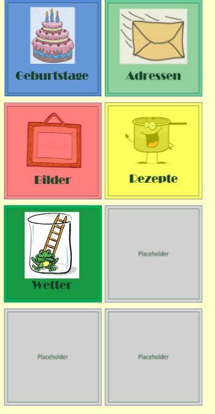

# Webserver

## Overview
This is a python Django based webserver to manage data like recipes, adresses, certain dates such as birthdays etc.

Reference to the Django Manual [link](https://www.djangoproject.com/)

The main page looks like this: \


## Preconditions
- create a postgres database named "django_framework"
- create the required scheme with the tables

## Instructions
Start the server with
```
python3 manage.py runserver 0.0.0.0:8001
```

Link to Main Page (login required):
```
http://localhost:8001/admin
```

admin page (login required):
```
http://localhost:8001/admin
```

## License
[MIT](./LICENSE)
